# Dynamic Agent Framework: Self-Service Agent Creation

**Status:** Draft  
**Author:** [Your Name]  
**Last Updated:** [Date]  
**Reviewers:** [Principal Engineers]

---

## 1. Executive Summary

This document proposes a design for enabling self-service agent creation within the Integrated Developer Portal (IDP). Currently, agents are statically defined in code with only two predefined configurations supported. This design introduces a control plane for agent lifecycle management, defines integration contracts with external systems, and addresses runtime considerations for scalability.

---

## 2. Problem Statement

The current agent framework supports basic chatbot agents via LangChain's `create_react_agent`, exposed through Chainlit and consumed by the IDP's React-based widget. Each agent is configured with:

- A system prompt
- MCP server connections (via multiserver client)
- Vector search capabilities backed by user-provided documentation

**Current Limitations:**

1. Agent definitions are hardcoded—no mechanism for users to create or manage agents
2. No persistent agent metadata or lifecycle management
3. Document ingestion for RAG is not integrated with enterprise systems
4. MCP client instantiation is not optimized for multi-agent or multi-session scenarios

**Desired State:**

Enable application teams to define, configure, and manage their own agents through the IDP, with proper integration across the control plane, runtime, and data plane.

---

## 3. Goals and Non-Goals

### Goals

- Define a canonical agent configuration model owned by the IDP
- Establish data contracts for enterprise document ingestion integration
- Clarify system boundaries and ownership between IDP, Chainlit runtime, and external services
- Identify open architectural questions requiring stakeholder alignment

### Non-Goals

- Implementation details of the ingestion system (owned by external team)
- Changes to the core LangChain agent execution model
- User-facing UI/UX design for agent creation workflows

---

## 4. System Architecture Overview

The proposed architecture separates concerns into three distinct layers:

```mermaid
flowchart TB
    subgraph ControlPlane["Control Plane (IDP)"]
        UI[IDP Web Interface]
        API[Agent Management API]
        DB[(Agent Registry DB)]
        UI --> API
        API --> DB
    end

    subgraph Runtime["Runtime Layer (Chainlit)"]
        CL[Chainlit Server]
        AF[Agent Factory]
        LC[LangChain Agent Executor]
        MCP[MCP Client Manager]
        CL --> AF
        AF --> LC
        LC --> MCP
    end

    subgraph DataPlane["Data Plane"]
        VS[(Vector Store)]
        ING[Ingestion Service]
        MCPS[MCP Servers]
    end

    API -->|Agent Config| CL
    API -->|Document Manifest| ING
    ING -->|Ingestion Receipt| API
    ING --> VS
    LC -->|Retrieval| VS
    MCP --> MCPS
```



### Layer Responsibilities

| Layer | Responsibility | Owner |
|-------|----------------|-------|
| **Control Plane** | Agent CRUD, entitlements, document registration, lifecycle management | IDP Team |
| **Runtime** | Agent instantiation, session management, request routing | Agent Framework Team |
| **Data Plane** | Document storage/retrieval, tool execution | Shared / External |

---

## 5. Detailed Design

### 5.1 Agent Configuration Model

The agent definition serves as the canonical representation of an agent across all systems.


#### Agent Status Lifecycle


#### Schema Definition

```yaml
AgentDefinition:
  identity:
    id: uuid
    name: string (unique per team)
    description: string
    owner_team: string
    status: enum [draft, provisioning, active, deprecated, failed]
    
  behavior:
    system_prompt: text
    model_parameters:
      model: string
      temperature: float
      max_tokens: int
    guardrails:
      blocked_topics: string[]
      output_constraints: object
      
  capabilities:
    mcp_servers:
      - name: string
        url: string
        transport: enum [http, stdio, sse]
        allowed_tools: string[] | null  # null = all tools
    rag_collections:
      - collection_id: string
        retrieval_config:
          top_k: int
          similarity_threshold: float
          
  lifecycle:
    version: int
    created_at: timestamp
    updated_at: timestamp
    created_by: string
```

#### Open Questions — Agent Configuration

| # | Question | Options | Recommendation |
|---|----------|---------|----------------|
| 1 | Where does the agent definition live? | (a) IDP's existing database (b) Dedicated agent registry service | TBD — depends on IDP's data architecture preferences |
| 2 | How do we handle versioning on active agents? | (a) Immutable versions, explicit activation (b) In-place updates with audit log | Recommend (a) for auditability |
| 3 | What's the entitlement model? | (a) Per-agent ACLs (b) Inherit from IDP team RBAC | Recommend (b) to reduce complexity |

---

### 5.2 Document Ingestion Integration

#### Context

The enterprise document ingestion system is currently in onboarding phase without stable APIs. We propose defining a minimal data contract to decouple our system from their implementation timeline.

#### Integration Flow


#### Data Contracts

**Outbound: Document Manifest (IDP → Ingestion Service)**

```json
{
  "manifest_id": "uuid",
  "agent_id": "uuid",
  "collection_id": "string",
  "documents": [
    {
      "document_id": "uuid",
      "source_type": "confluence | sharepoint | git | url",
      "source_url": "string",
      "content_hash": "sha256",
      "metadata": {
        "title": "string",
        "author": "string",
        "last_modified": "timestamp"
      },
      "chunking_strategy": "default | code | markdown | sliding_window",
      "chunking_params": {
        "chunk_size": 512,
        "chunk_overlap": 50
      }
    }
  ],
  "callback_topic": "string",
  "requested_at": "timestamp"
}
```

**Inbound: Ingestion Receipt (Ingestion Service → IDP)**

```json
{
  "manifest_id": "uuid",
  "collection_id": "string",
  "status": "completed | partial | failed",
  "documents": [
    {
      "document_id": "uuid",
      "status": "success | failed | skipped",
      "chunk_count": 42,
      "error_details": null
    }
  ],
  "collection_stats": {
    "total_chunks": 156,
    "total_documents": 4
  },
  "completed_at": "timestamp"
}
```

#### Deduplication Strategy

To avoid reprocessing unchanged documents:


#### Open Questions — Document Ingestion

| # | Question | Options | Recommendation |
|---|----------|---------|----------------|
| 1 | Who owns chunking strategy selection? | (a) Per-agent config (b) Per-document-type (c) System default | Recommend (a) with (c) as fallback |
| 2 | Where does deduplication logic live? | (a) IDP (our side) (b) Ingestion service (their side) | Recommend (a) — don't depend on their implementation |
| 3 | How do we handle ingestion failures? | (a) Agent blocks until RAG ready (b) Agent degrades gracefully | Recommend (b) with clear UX indication |
| 4 | What's the SLA expectation for ingestion? | Sync (seconds) vs Async (minutes/hours) | Need input from ingestion team |

---

### 5.3 MCP Client Lifecycle Management

#### Current State

Each agent session instantiates a `MultiServerMCPClient` with a generic `httpx` client. This approach has scaling implications as agent count and concurrent sessions grow.

#### Proposed Client Lifecycle Model


#### Design Considerations

| Approach | Pros | Cons |
|----------|------|------|
| **Per-Session** (current) | Full isolation, simple | Connection overhead, resource waste |
| **Per-Agent** (shared) | Efficient, connection reuse | Requires thread-safety, shared state risks |
| **Connection Pool** | Best efficiency | Most complex, needs health management |

#### MCP Server Health Handling


#### Open Questions — MCP Runtime

| # | Question | Options | Recommendation |
|---|----------|---------|----------------|
| 1 | What's the right client lifecycle? | (a) Per-session (b) Per-agent (c) Pooled | Start with (a), migrate to (b) based on metrics |
| 2 | How do we handle MCP server failures? | (a) Fail open (b) Fail closed (c) Configurable per-agent | Recommend (c) with (a) as default |
| 3 | Is MCP server list static or dynamic? | (a) Fixed at agent creation (b) Resolved at runtime per user entitlements | Depends on entitlement model decision |

---

## 6. Cross-Cutting Concerns

### 6.1 Agent Synchronization

Agent configuration must be consistent between IDP (source of truth) and Chainlit runtime.


**Options:**
1. **Pull-based:** Chainlit polls IDP for config changes (simple, eventual consistency)
2. **Push-based:** IDP publishes events on config change (complex, near real-time)
3. **Hybrid:** Cache with TTL + event-based invalidation

### 6.2 Observability

| Signal | What to Track |
|--------|---------------|
| **Metrics** | Agent creation rate, session count per agent, tool call latency, RAG retrieval latency |
| **Logs** | Agent lifecycle events, ingestion status changes, MCP errors |
| **Traces** | End-to-end request flow: IDP → Chainlit → LLM → MCP → Response |

### 6.3 Security Considerations

- **Agent Isolation:** Agents should not access other agents' RAG collections or MCP servers
- **Secret Management:** MCP server credentials must not be stored in plaintext
- **Input Validation:** System prompts and configurations must be sanitized

---

## 7. Rollout Strategy


---

## 8. Risks and Mitigations

| Risk | Likelihood | Impact | Mitigation |
|------|------------|--------|------------|
| Ingestion service API instability | High | High | Define minimal contract, build adapter layer, implement retry logic |
| Agent config drift between systems | Medium | Medium | Event-driven sync with cache invalidation |
| MCP connection scaling bottleneck | Medium | Medium | Monitor connection metrics, plan for pooling |
| RAG collection orphaning on agent delete | Low | Medium | Implement lifecycle hooks, background cleanup job |
| Entitlement model mismatch | Medium | High | Align early with IDP team on RBAC integration |

---

## 9. Open Questions Summary

### For IDP Principal Engineers

1. Does the three-layer model (control plane / runtime / data plane) align with IDP's platform architecture?
2. Should agent definitions live in IDP's existing database schema, or warrant a dedicated service?
3. What's the preferred entitlement model—per-agent ACLs or inherited team RBAC?
4. Are there existing patterns for managing external resource references (like RAG collections)?

### For Ingestion Service Team

5. What's the expected SLA for document ingestion (sync vs async)?
6. Can we agree on the proposed manifest/receipt contract as a starting point?
7. Who owns chunking strategy logic—caller or ingestion service?

### For Agent Framework Team (Internal)

8. What's our tolerance for eventual consistency in agent config propagation?
9. Should MCP failure mode be configurable per-agent or system-wide?

---

## 10. Appendix

### A. Glossary

| Term | Definition |
|------|------------|
| **Control Plane** | Systems responsible for configuration, lifecycle, and policy management |
| **Data Plane** | Systems responsible for actual data processing and retrieval |
| **MCP** | Model Context Protocol — standard for LLM tool integrations |
| **RAG** | Retrieval-Augmented Generation — enhancing LLM responses with retrieved context |
| **Idempotency** | Property where repeated operations produce the same result |

### B. References

- [LangChain Agent Documentation](https://python.langchain.com/docs/modules/agents/)
- [Model Context Protocol Specification](https://modelcontextprotocol.io/)
- [Chainlit Documentation](https://docs.chainlit.io/)

---

## 11. Revision History

| Version | Date | Author | Changes |
|---------|------|--------|---------|
| 0.1 | [Date] | [Name] | Initial draft |
